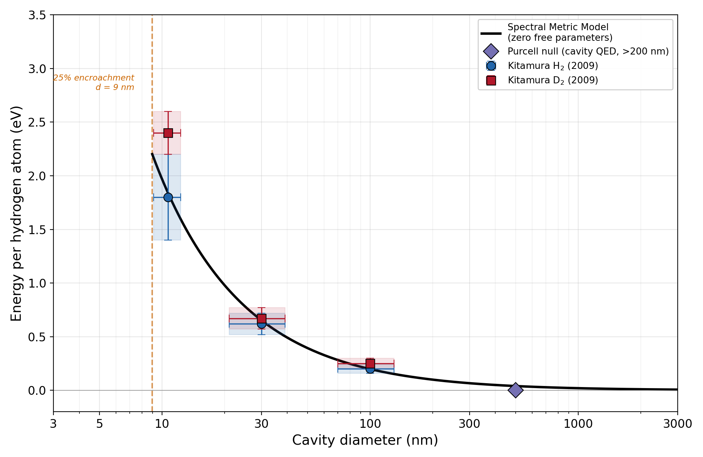

# Cavity-Size Dependent Excess Heat from Hydrogen Isotopes: A Zero-Parameter Hypothesis

**Author:** Keith Brodie (2026)

## Summary

Kitamura et al. (2009) measured excess heat from hydrogen and deuterium absorbed into palladium nanoparticles at three characterized grain sizes (100, 30, and 10.7 nm). Energy per atom increases sharply with decreasing particle size. No nuclear products were detected.

We propose that the vacuum permittivity is entirely emergent from the electromagnetic vacuum mode spectrum. A metallic nanocavity excludes modes below a size-dependent cutoff, modifying the local permittivity. The hydrogen ground state — modelled as a 2D spherical current shell (Mills, 2018) — shifts in energy by:

```math
\Delta E = 13.6\left(\frac{1}{f^2} - 1\right) \text{ eV}
```

where the surviving mode fraction is:

```math
f^2(d) = \sum_n \exp\!\left(-\beta\, \frac{z_n\, a_0}{d/2}\right) \times \frac{\pi\, a_0\, \beta}{d/2}
```

with screening parameter from 2D surface geometry, and mode zeros from PEC sphere boundary conditions. Zero free parameters.

## Key Result

| Material | d (nm) | Measured H (eV) | Measured D (eV) | Predicted (eV) |
|---|:-:|:-:|:-:|:-:|
| PP (Pd powder) | 100 | 0.20 +/- 0.07 | 0.25 +/- 0.09 | 0.198 |
| PB (Pd-black) | ~30 | 0.62 +/- 0.11 | 0.67 +/- 0.12 | 0.653 |
| PZ (Pd-ZrO2) | 10.7 | 1.80 +/- 0.40 | 2.40 +/- 0.20 | 1.836 |

Six measurements, zero free parameters, all within error bars.

## Figure



## Files

- [`PAPER_DRAFT.md`](PAPER_DRAFT.md) — Full paper (Markdown with math blocks)
- `figure_cavity_size.py` — Figure generation and model calculation script
- `figure_cavity_size.png` — Figure 1: model curve vs Kitamura data with error boxes

## Running the Code

```bash
pip install numpy scipy matplotlib
python figure_cavity_size.py
```

Requires `numpy`, `scipy`, and `matplotlib`.

## Related Papers

1. **Paper 1:** K. Brodie, "Quantized Inertia as a Boundary Correction to Jacobson's Thermodynamic Spacetime" (2026). [DOI: 10.5281/zenodo.18664801](https://doi.org/10.5281/zenodo.18664801)

2. **Paper 4:** K. Brodie, "MOND from Horizon Thermodynamics: Deriving the Radial Acceleration Relation with Zero Free Parameters" (2026). [DOI: 10.5281/zenodo.18677307](https://doi.org/10.5281/zenodo.18677307)

3. **Paper 5:** K. Brodie, "Tensor Inertia from Two Horizons: Jacobson's Thermodynamic Spacetime in a Finite Universe" (2026). [DOI: 10.5281/zenodo.18677307](https://doi.org/10.5281/zenodo.18677307)

## License

This work is licensed under [CC BY 4.0](https://creativecommons.org/licenses/by/4.0/).
